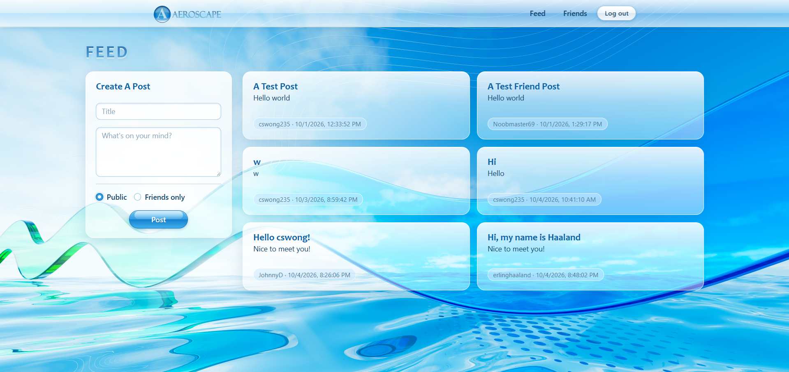

# 

A project built to let people create posts and befriend one another.

Features include:
- Login and registration with JWT authentication
- Create public or friends-only posts
- User list containing users to add friends

Built with:
- JavaScript (ES6)
- PostgreSQL
- React
- HTML
- CSS
- Bootstrap

Deployed with:
- Vercel: For frontend and backend service
  - Backend service can be found here: https://github.com/cswong235/aeroscape-backend
- Supabase: For database hosting

## Links
- Vercel link: https://aeroscape-frontend.vercel.app/
